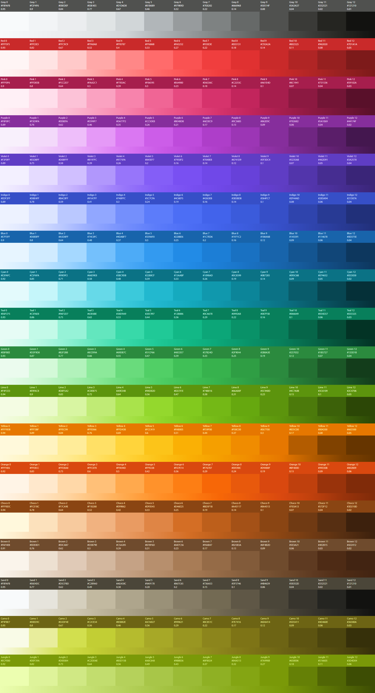

# Colar
A universal color palette based on Open Color. Please read [the article](https://ferdychristant.com/color-for-the-color-challenged-884c7aa04a56) that accompanies this repro to learn about:

 * Open Color as a basis and the extensions added to it in this repro
 * How to analyze the characteristics of any color palette
 * Advanced color testing and discovery
 * Techniques to add your own personal hues in a qualitative and consistent way

